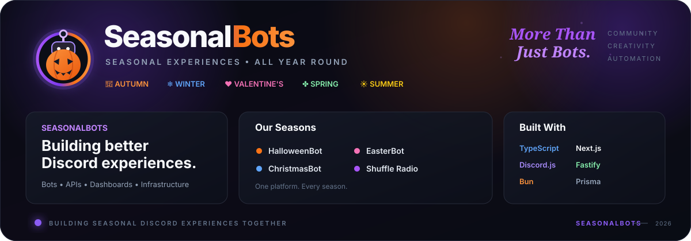

<p align="center">
  
</p>

# 🎉 SeasonalBots

**Seasonal experiences for Discord, all year round.**

SeasonalBots creates Discord bots, web applications, APIs, radio services, and community tools designed to make servers more interactive throughout the year.

From spooky Halloween events 🎃 and Christmas celebrations 🎄 to Easter adventures 🐣, our services bring games, countdowns, events, music, and seasonal experiences directly to Discord communities.

SeasonalBots is owned and operated by **NodeByte LTD**.

---

## 🌟 Our Bots & Services

Each SeasonalBots project has its own identity while being part of the wider SeasonalBots ecosystem.

| Project | Theme | What it does | Status |
| --- | --- | --- | --- |
| **HalloweenBot** 🎃 | Halloween | Events, games, countdowns, customisation and interactive Halloween experiences | ✅ Active |
| **ChristmasBot** 🎄 | Christmas | Festive events, games, countdowns and Christmas server features | ✅ Active |
| **EasterBot** 🐣 | Easter & Spring | Egg hunts, Easter events, countdowns and interactive activities | 🚧 In Development |
| **Shuffle Radio** 📻 | Music | 24/7 radio and music experiences for Discord communities | 🚧 In Development |

More seasonal projects are planned as the platform continues to grow.

---

## 🚀 The SeasonalBots Platform

SeasonalBots is more than a collection of Discord bots.

Our central platform connects SeasonalBots services into a single ecosystem, providing users with one place to manage their account, servers, Premium benefits, support and connected services.

### Platform Features

* 🔗 **Connected Services** — Link supported SeasonalBots services to one account.
* 🖥️ **Central Dashboard** — Manage connected servers and services from one place.
* 💎 **SeasonalBots Premium** — Manage subscriptions and assign Premium benefits to supported Discord servers.
* 🎫 **Support Platform** — Get help and manage support requests.
* 📊 **Service Status** — View the current health and availability of SeasonalBots infrastructure.
* 📚 **Documentation** — Guides, references and resources for our services.
* 📰 **Blog & Changelog** — Follow announcements, releases and platform improvements.
* 🧪 **Beta Programme** — Test upcoming features before their public release.
* 🌐 **Shared Infrastructure** — APIs and services powering the wider SeasonalBots ecosystem.

---

## 💎 SeasonalBots Premium

**SeasonalBots Premium** unlocks additional functionality and customisation across supported services.

Subscriptions are managed centrally through SeasonalBots, allowing Premium entitlements to be assigned to eligible Discord servers and synchronised with supported bots.

Depending on the service and plan, Premium features may include:

* 🎨 Advanced customisation and branding
* ⏱️ Advanced countdown configuration
* 🔗 Webhook integrations
* 💬 Additional custom commands
* 👋 Welcome and farewell customisation
* 🛡️ Additional moderation functionality
* 📈 Analytics and insights
* 🧪 Early access to selected beta features
* 🎫 Priority support

Features and availability vary between SeasonalBots services and Premium plans.

---

## 🛠️ What We Build

SeasonalBots isn't limited to Discord bot code.

Our organisation develops and maintains:

* 🤖 Discord bots
* 🌐 Websites and dashboards
* ⚡ REST APIs and internal services
* 📻 Radio and audio services
* 📊 Status and monitoring systems
* 🔐 Authentication and account services
* 💳 Premium and subscription systems
* 📚 Documentation
* 🧰 Internal tooling and infrastructure

Many of these systems work together behind the scenes to provide a unified SeasonalBots experience.

---

## ⚙️ Technology

Our projects use a modern technology stack focused on performance, maintainability and reliability.

| Area | Technologies |
| --- | --- |
| 🧠 **Runtime** | Node.js & Bun |
| 🤖 **Discord** | Discord.js |
| ⚡ **Backend** | Fastify & Next.js |
| 🖥️ **Frontend** | Next.js, React & TypeScript |
| 🎨 **Styling** | Tailwind CSS |
| 🗄️ **Database** | PostgreSQL |
| 🔷 **ORM** | Prisma |
| ⚡ **Caching** | Redis |
| 🔐 **Authentication** | Discord OAuth |
| 💳 **Payments** | Stripe |
| 🐳 **Infrastructure** | Docker |
| 🎵 **Audio** | Lavalink |

Individual repositories may use different technologies depending on their requirements.

---

## 📂 Organisation Structure

The SeasonalBots GitHub organisation contains the projects and supporting services that power our ecosystem.

```text
SeasonalBots/
│
├── 🎃 HalloweenBot
│   ├── Discord Bot
│   ├── API
│   ├── Dashboard
│   └── Website
│
├── 🎄 ChristmasBot
│   ├── Discord Bot
│   ├── API
│   ├── Dashboard
│   └── Website
│
├── 🐣 EasterBot
│   └── Seasonal Services
│
├── 📻 Radio
│   └── Shuffle & Seasonal Radio Services
│
├── 🌐 SeasonalBots Platform
│   ├── Website
│   ├── Accounts
│   ├── Premium
│   └── Support
│
├── 📊 Status
│   └── Service Monitoring
│
├── 📚 Documentation
│
└── 🛠️ Infrastructure
